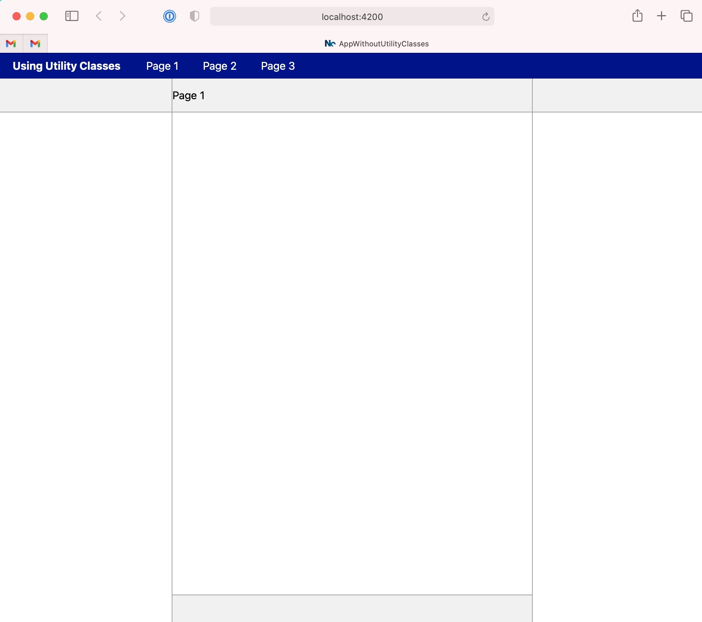
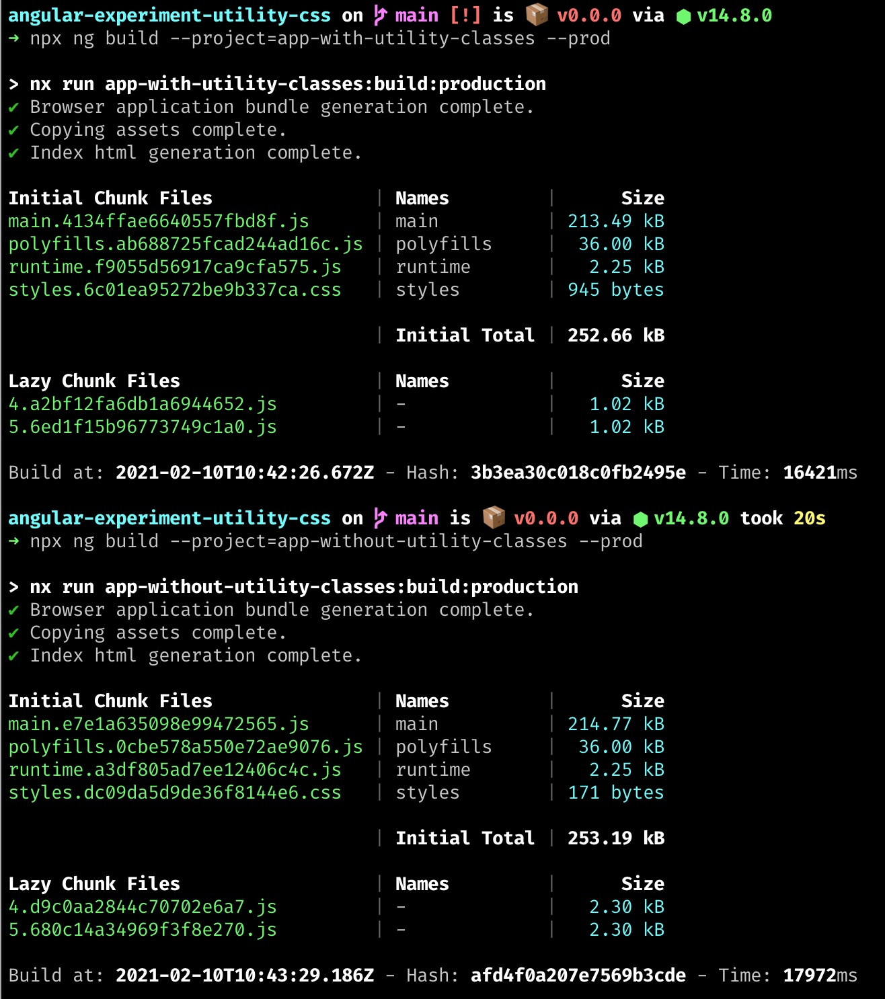

# Angular Experiment: Css Utility Classes

## Context

This is a repository contains an experiment with css utility classes in an angular applications.

With this experiment I am trying to find out the impact of using css utility classes in the DOM (versus individual css styles per component) on bundle sizes.

The need (idea) for this experiment comes from the debate around the usage of css utility class frameworks (like [tachyons](https://tachyons.io) and [TailwindCss](https://tailwindcss.com)) and naming conventions like BEM and
increased by the fact that Angular CLI is going to support TailwindCss in the future.

The experiment is only going to look at the bundle sizes output, not the maintainability or other pro/con for using utility classes in Angular applications. 

## Setup

Both applications have been set up in a very similar way. They both have 3 routes of which 2 are lazy loaded.
The reason 1 route is not lazy is to make the results easier to read; Angular CLI prints the `Initial Total` value upon build, by having the first route not lazy it is 
also counted towards the `Initial Total` value which make sense as a route always needs to be loaded.

In the `apps` folder in the root there is a `shared.scss` file with base styles (scss mixins) to build layouts in both applications.

`app-with-utility-classes` will expose the mixins as regular css classes. Every container will have DOM elements in its template that will use the exposed classes to arrange its layout.

`app-without-utility-classes` will use the mixins in each individual style file with the defined css classes from the component's template. 

### Application screenshot

## The results

It looks like putting shared styles in a global CSS file results in a smaller initial total size, and also smaller file sizes for lazy loaded chunks.

The differences might seem negligible at first but putting styles in a component's style definitions will put the resulted style in the created `js` file, not a css file.
Besides (small) bundle size differences, this also means that JavaScript needs to be parsed and executed to add a style tag to the application before the actual styles are available to the browser.

